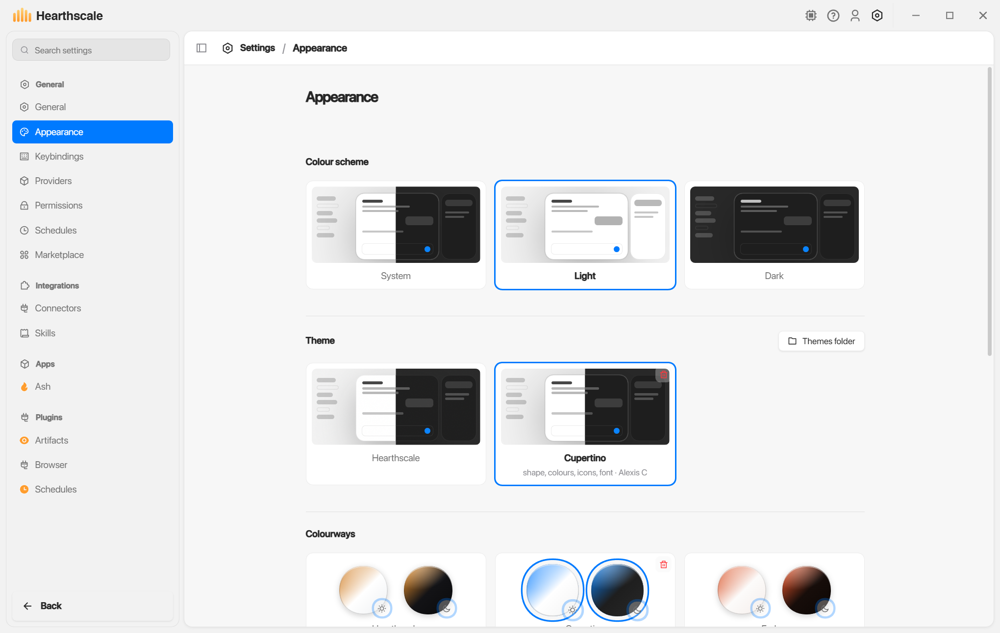
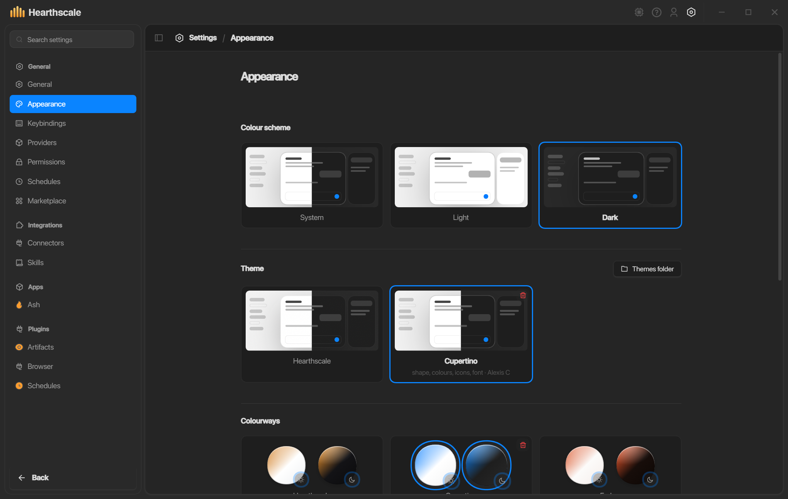

# Cupertino for Hearthscale

An Apple-inspired desktop theme for Hearthscale: blue selection, quiet translucent
surfaces, compact text controls, continuous corners and soft shadows. It adapts the
macOS branch of [Obsidian Cupertino](https://github.com/aaaaalexis/obsidian-cupertino)
by Alexis C. The colourways, icon set and system font stack can each be used separately.

Requires the greenfield desktop's September 10, 2026 shell styling API. Builds made
before that API do not provide all the component hooks this theme uses.

## Preview

Captured in the Windows desktop at 100% interface size.





## Install

1. Download `cupertino.tar.gz` from [Releases](https://github.com/T-R3x3r/hearthscale-cupertino/releases).
2. Extract it. In Hearthscale, open **Settings > Appearance > Themes folder**.
3. Copy the extracted `cupertino` folder into that directory. Its `manifest.json`
   must sit directly inside `themes/cupertino/`.
4. Select **Cupertino** in the Theme picker. It applies the theme's light and dark
   colourways, icons and font stack. Each picker can then be changed independently.

You can also clone this repository directly into `themes/cupertino`. The extra source
files are ignored by the loader. Edits to the CSS apply live while the theme is selected.
A user-installed copy takes precedence over the bundled copy. Remove the user copy
from Appearance, then select the bundled version again. Theme Marketplace installation is not implemented yet.

## Make your own theme

This repository is an ordinary theme folder, with no application code or privileged
loader path. Copy it, change the name in `manifest.json`, and install it under your own
folder name. There is no build step for editing CSS.

| File                               | Purpose                                                              |
| ---------------------------------- | -------------------------------------------------------------------- |
| `manifest.json`                    | Display name and author                                              |
| `theme.css`                        | Component geometry, typography, motion, materials and state styling  |
| `light.css`, `dark.css`            | Independent complete colourways                                      |
| `icons/`                           | Remix Icon SVGs keyed by interface role; transcript roles in `chat/` |
| `fonts/manifest.json`              | Font families; no font binaries are bundled                          |
| `LICENSE.txt`, `icons/LICENSE.txt` | Upstream notices                                                     |

The theme layer follows Hearthscale's base styles. Colourways follow the theme, so
use `var(--accent)` and `var(--accent-ink)` for selection instead of hardcoding blue
into component selectors. Our colourways supply the blue. The shell's public `hs-*`
component classes are documented in Hearthscale's `packages/ui/CLASSES.md` and
`packages/ui/src/shell.css`.

Keep assets local. The loader rejects remote CSS imports/URLs, `!important`, and
unbalanced braces. `--bg` and `--capt` in colourway sheets must be literal colours
because the native frame reads them before CSS renders. Approval controls remain
subject to the guard layer's presence and interaction rules; their presentation can be themed.
CSS is trusted author code, so this guard is not a sandbox for hostile themes. Native
OS menus/window controls, third-party website content and the avatar rig are outside
the stylesheet boundary.

`--session-row-height`, `--subagent-row-height` and `--project-row-height` size the
virtual list's slots. Keep the corresponding visible rows within their slots.
Hearthscale measures those slots when a theme or its density changes.

## Icons and release

The SVGs are committed, so installing needs no Node dependencies. To regenerate:

```sh
npm ci
npm run icons
npm run pack
```

`pack` requires `tar` (included with Windows, macOS and common Linux distributions).
It writes `dist/cupertino.tar.gz` and prints its SHA-256. Publish that file on a tagged
GitHub release. Hearthscale's bundled-theme pin records the immutable release URL and
hash; its build downloads and verifies the archive. The installed app stays offline.

The font stack uses SF Pro where installed, then the platform's interface font. Apple's
fonts are not redistributed. Remix Icon 4.9.1 supplies the line glyphs under Apache-2.0;
Obsidian Cupertino's adapted values retain its MIT notice. This is a Hearthscale port,
not an Apple product or an upstream Obsidian release.
