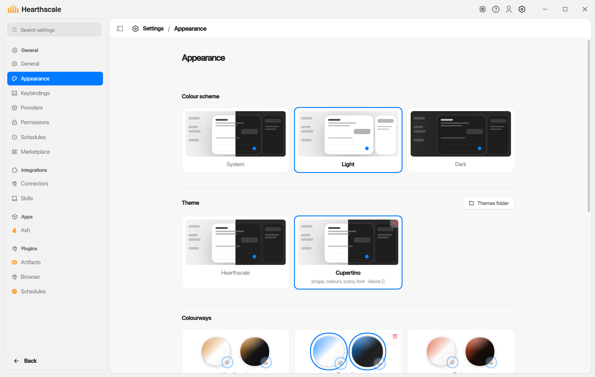
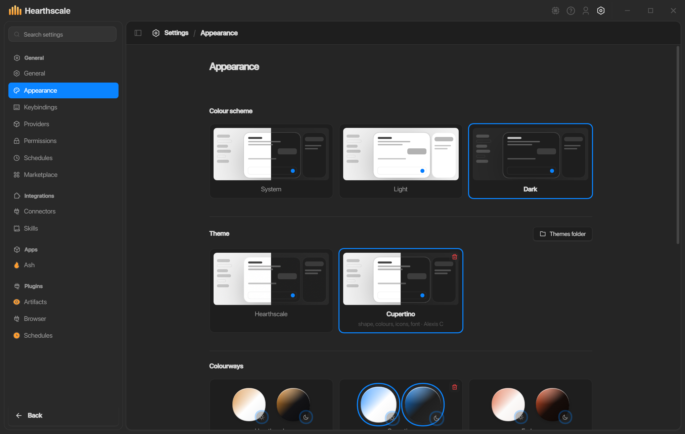

# Cupertino

An Apple-inspired look for Hearthscale: blue selection, quiet translucent surfaces, compact text controls, continuous corners and soft shadows, with light and dark colourways, an icon set and a system font stack of its own.

## Get started

Choose **Install**, then **Apply**. Cupertino then dresses Hearthscale in its theme, its light and dark colourways, its icons and its font. Each of them can be changed on its own under **Settings → Appearance**, so you can keep, for example, Cupertino's colours with Hearthscale's own icons.

The font is SF Pro where your computer has it, and your system's interface font otherwise. Apple's fonts are not included.

## What Cupertino asks for

Nothing. A theme changes only how Hearthscale looks: it holds no program, and Hearthscale loads nothing for it from the network.

## Credits

Cupertino adapts the macOS look of [Obsidian Cupertino](https://github.com/aaaaalexis/obsidian-cupertino) by Alexis C., under its MIT licence. Its icons are [Remix Icon](https://remixicon.com) 4.8.0, under the Apache 2.0 licence. It is a Hearthscale theme, not an Apple product or a release of Obsidian Cupertino.
